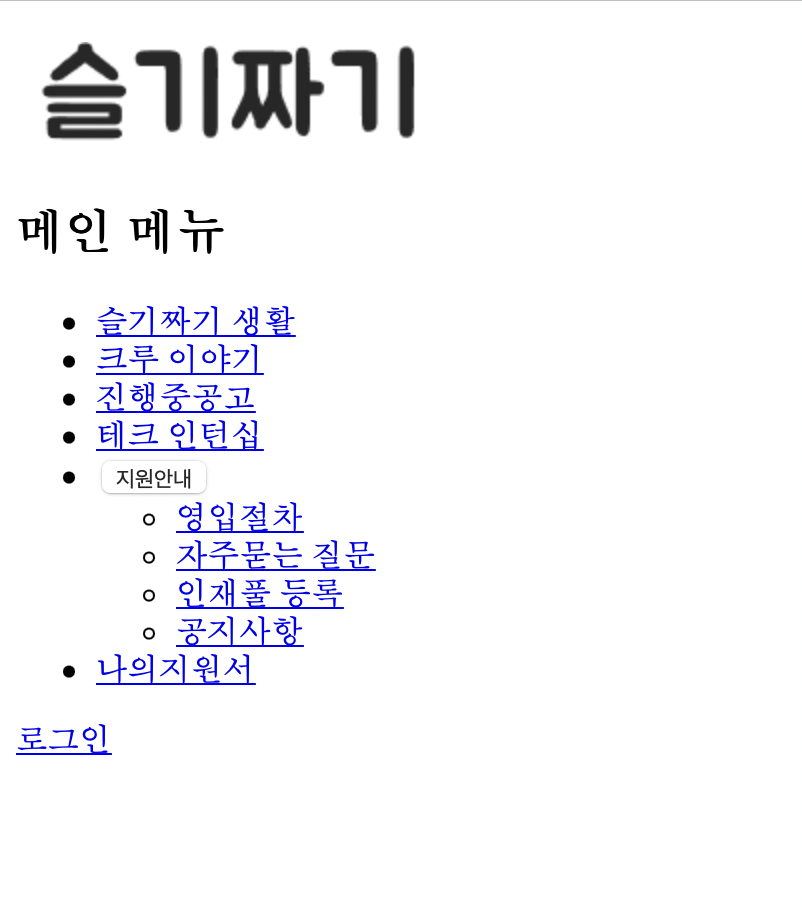
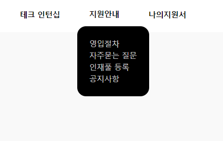

# Get to Know Web
**The code is originated from 
https://careers.kakao.com/jobs**

## Installation

1. Fork this repository.
- click the `fork` button at the top-right of the repository in Github.

2. Clone forked repository

```
    $ git clone https://github.com/your-username/get-to-know-web.git
```

## Step 1: HTML Only
* Create a single webpage which contains a logo and list of links to other pages.



## Step 2: Add CSS to HTML
* Create a dropdown displayed as follows.
* HTML and JavaScript for dropdown are provided, just add proper CSS properties.

